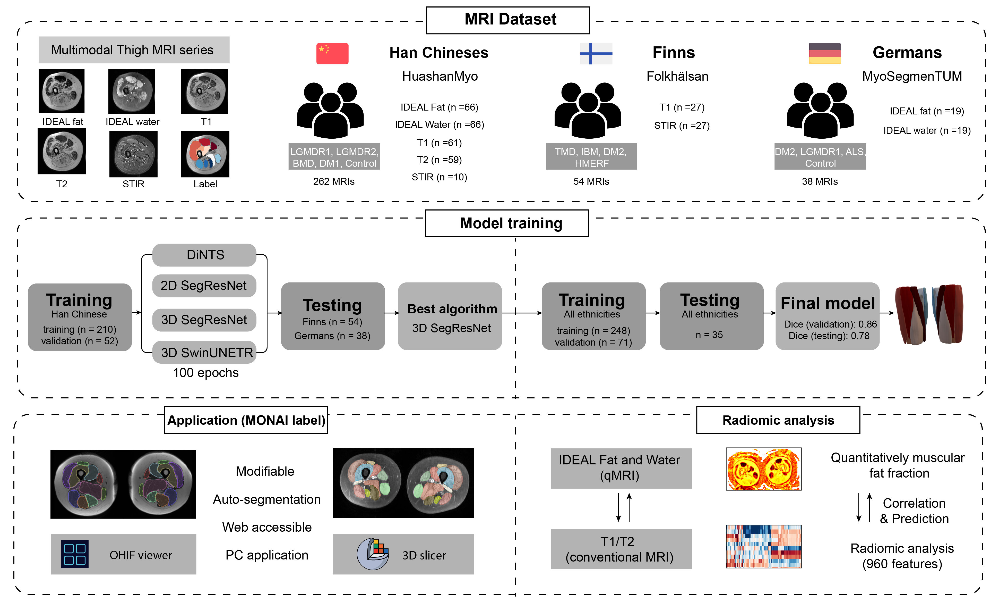
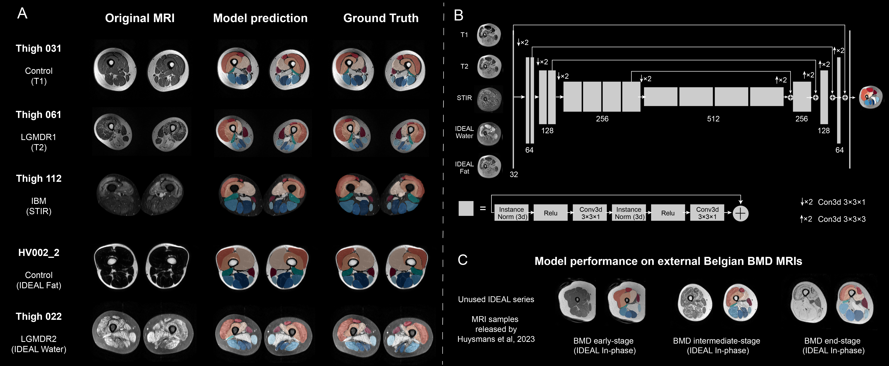

# Multimodal-Multiethnic-Thigh-Muscle-MRI-analysis
A thigh muscle segmentation tool trained using a multimodal and multiethnic MRI dataset 




## Model description

- A 3D segmentation model based on [SegResNet](https://github.com/Project-MONAI/tutorials/tree/main/auto3dseg)
- Trained using multi-ethnic thigh MRIs from both myopathy patients and healthy controls (metadata available in the repository)
- Suitable for training on any one of the multimodal MRI series, including IDEAL fat, IDEAL water, T1, T2, and STIR
- Targets 11 thigh muscles: BL - Biceps Femoris Long Head; BB - Biceps Femoris Short Head; ST - Semitendinosus; SM - Semimembranosus; AM - Adductor Magnus; VI - Vastus Intermedius; VL - Vastus Lateralis; VM - Vastus Medialis; RF - Rectus Femoris; GR - Gracilis; SA - Sartorius.


## Model's performance in testing MRIs


##  MRI data 
> You can download the Chinese and Finnish data at the "Releases" section, and the Germany data from this [link](https://osf.io/svwa7/?view_only=c2c980c17b3a40fca35d088a3cdd83e2). 
- **Han Chinese Thigh MRIs** (HuashanMyo): 262 MRIs (LGMDR1, LGMDR2, BMD, DM1, Control)
- **Finnish Thigh MRIs** ([Folkhälsan Research Center](https://www.folkhalsan.fi/en/knowledge/research/genetics/group-udd/)): 54 MRIs (TMD, IBM, DM2, HMERF)
- **Germany Thigh MRIs** ([MyoSegmenTUM](https://dx.plos.org/10.1371/journal.pone.0198200)): 38 MRIs (DM2, LGMDR1, ALS, Control)


## Model Implementation (MONAI label)

1. Install MONAI dependencies first.

```
pip install "monai-weekly[all]" "monailabel-weekly"
```

2. Then, copy the contents (including scripts and the model) of the "[MONAI label implementation](https://drive.google.com/drive/folders/19M_ZUCMFM0fwE_Z8Hn-sD3dFMr30v59u?usp=sharing)" folder into the [MONAI label](https://monai.io/label.html)'s config file located at "./apps/radiology".


3. Start "OHIF viewer" or "3D slicer" to run the model on your own MRI data. 


## Citation